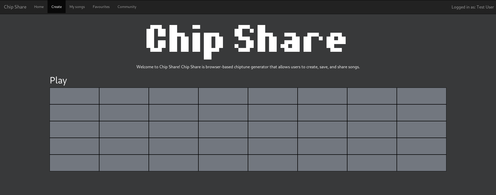

# chip-share

Week One:
---------

Alex: (Server) accounts, login, signup, cookies?

Carson: (Client) chiptune editor

Jake: prototype designs for main page / song listing

Mishel: prototype designs with Jake

Week Two:
---------
|||
|-|-|
|**Alex**|Create full song API (storing/retrieving songs, binary storage server format <-> JSON client format, CRUD requests).|
|**Carson**|Create/prepare individual components for website (song block, rating stars, editor, etc). Start implementation of users API.|
|**Jake**|Switch to external styling only. Switch to Bootstrap v4. Maybe find a free (v4) theme to speed up the design process. Work on overall styling & page responsiveness.|
|**Mishel**|Create a logo for Chip Share (if you can). Markup for required page 1 & 2 of assignment (placeholder content, that we can fill in later, use bootstrap).
|||